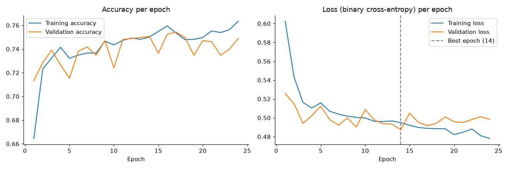

# Customer Churn & Retention Analytics System

Predicts whether a telecom customer will **churn** (cancel their service) using a Deep Neural Network built with **TensorFlow/Keras**, with preprocessing, class-imbalance handling and evaluation done in **Scikit-learn**, and exploratory analysis in **Pandas, Seaborn and Matplotlib**.

**Tech stack:** Python · TensorFlow (Keras) · Scikit-learn · Pandas · NumPy · Seaborn · Matplotlib

---

## 1. Problem statement

Getting a new customer usually costs a telecom company more than keeping an existing one. If the company can tell **in advance** which customers are likely to leave, it can act first, for example with a discount, a contract upgrade or a tech-support call.

**Task:** binary classification. Given a customer's account, service and billing information, predict `Churn` (1 = will leave, 0 = will stay) and output a churn **probability** the business can rank customers by.

## 2. Dataset

**IBM Telco Customer Churn** (`data/WA_Fn-UseC_-Telco-Customer-Churn.csv`, public sample dataset from IBM).

| Fact | Value |
|---|---|
| Rows × columns | 7,043 × 21 (19 features + `customerID` + `Churn`) |
| Target distribution | No: 5,174 (73.5%) · Yes: 1,869 (26.5%). **Imbalanced** |
| Missing values | 0 NaN at load time, but `TotalCharges` has **11 blank strings `" "`**, all for customers with `tenure = 0` |
| Duplicates | 0 exact duplicates. 22 rows repeat when `customerID` is ignored. They are different customers with identical profiles, so they are kept |

### Columns

| Column | Type | Meaning |
|---|---|---|
| `customerID` | ID | Unique customer ID. **Dropped** (it has no predictive meaning) |
| `gender` | categorical | Male / Female |
| `SeniorCitizen` | binary (0/1) | 1 if the customer is 65 or older |
| `Partner`, `Dependents` | Yes/No | Has a partner / has dependents |
| `tenure` | numeric | **Months** the customer has been with the company (0–72) |
| `PhoneService`, `MultipleLines` | categorical | Phone service and whether they have multiple lines |
| `InternetService` | categorical | DSL / Fiber optic / No |
| `OnlineSecurity`, `OnlineBackup`, `DeviceProtection`, `TechSupport`, `StreamingTV`, `StreamingMovies` | categorical | Add-on services: Yes / No / No internet service |
| `Contract` | categorical | Month-to-month / One year / Two year |
| `PaperlessBilling` | Yes/No | Gets bills electronically |
| `PaymentMethod` | categorical | Electronic check / Mailed check / Bank transfer (automatic) / Credit card (automatic) |
| `MonthlyCharges` | numeric | Current monthly bill |
| `TotalCharges` | numeric (stored as text!) | Total billed so far (≈ tenure × monthly charges) |
| **`Churn`** | **target** | **Yes** = customer left within the last month, **No** = stayed. Mapped to 1 / 0 |

## 3. Project structure

```
customer-churn/
├── data/WA_Fn-UseC_-Telco-Customer-Churn.csv   raw dataset
├── notebooks/churn_eda.ipynb                   dataset inspection + EDA walkthrough + prediction demo
├── src/
│   ├── data_loader.py     load CSV, fix TotalCharges, drop ID, encode target, column lists
│   ├── eda.py             all Seaborn/Matplotlib plots (saved to reports/figures)
│   ├── preprocessing.py   Scikit-learn Pipeline + ColumnTransformer
│   ├── model.py           Keras DNN definition
│   ├── train.py           split → preprocess → class weights → train → evaluate → save
│   ├── evaluate.py        metrics, confusion matrix, ROC curve, training curves
│   └── predict.py         predict_churn(customer_dict) → probability + class
├── models/                preprocessor.joblib + churn_dnn.keras (created by train.py)
├── reports/figures/       every plot produced by EDA and training
├── INTERVIEW_PREP.md      interview preparation for this project
├── requirements.txt
└── README.md
```

## 4. Architecture (end-to-end flow)

```
 raw CSV
   │  data_loader.py: TotalCharges text→number (blanks→NaN), drop customerID, Churn Yes/No→1/0
   ▼
 stratified split  ──►  train 64% (4,507) │ validation 16% (1,127) │ test 20% (1,409)
   │
   ▼  preprocessing.py: fit on TRAIN ONLY, then transform val/test
 ColumnTransformer
   ├─ numeric (tenure, MonthlyCharges, TotalCharges): median imputer → StandardScaler
   └─ categorical (16 columns): most-frequent imputer → OneHotEncoder
   ▼
 46 numeric features
   ▼  model.py
 Input(46) → Dense(32, ReLU) → Dropout(0.3) → Dense(16, ReLU) → Dropout(0.3) → Dense(1, Sigmoid)
   ▼
 churn probability (0–1) → threshold 0.5 → class 0/1
```

## 5. Preprocessing

| Step | How | Why |
|---|---|---|
| Fix `TotalCharges` | `pd.to_numeric(errors="coerce")` turns the 11 blanks into NaN | The column was text, so the model could not use it as a number |
| Missing values | `SimpleImputer(strategy="median")` inside the pipeline | Median is robust to skew. It is learned from training data only |
| Categorical encoding | `OneHotEncoder(handle_unknown="ignore")` | Categories have no order, so each one gets its own 0/1 column. Unseen categories at prediction time become all zeros instead of crashing |
| Feature scaling | `StandardScaler` → (x − mean) / std | `TotalCharges` goes up to ~8,700 while one-hot columns are 0/1. Scaling keeps gradient descent stable and stops one feature dominating just because its numbers are large |
| Split | `train_test_split(..., stratify=y)` twice | Every split keeps the same 26.5% churn rate |

**Data leakage:** the imputer and scaler are fitted **only on the training set** (`fit_transform(X_train)`). Validation and test data only go through `transform`. If the scaler were fitted on all the data, the test set's mean and standard deviation would leak into training, and the test score would be slightly optimistic. The test set has to act like customers the model has never seen.

## 6. EDA (key findings)

All figures are in `reports/figures/`, and every plot is explained in the notebook.

| Plot | Finding |
|---|---|
| Churn distribution | 26.5% churn. Always predicting "No churn" already gives 73.5% accuracy, so accuracy on its own is misleading |
| Contract | Month-to-month **42.7%** churn vs one-year 11.3% vs two-year **2.8%** |
| Tenure | Median tenure: churners 10 months vs 38 months for stayers. Churn is **47.4%** in the first 12 months and 9.5% after 48 months |
| Monthly charges | Median 79.65 (churned) vs 64.43 (stayed). Churn is concentrated in the high-bill range (fiber plans) |
| Payment method | Electronic check **45.3%** churn vs 15–19% for the other methods |
| Total charges | Churners have *lower* totals (703.55 vs 1683.60) because they leave early, not because they pay less |
| Correlation heatmap | tenure–Churn **−0.35**, MonthlyCharges–Churn **+0.19**, TotalCharges–Churn −0.20, tenure–TotalCharges **0.83** (redundant) |
| Services | Fiber optic 41.9% vs DSL 19.0%. No OnlineSecurity 41.8% / no TechSupport 41.6% vs ~15% with them. Streaming makes little difference |

## 7. Model

* **Architecture:** 46 → 32 (ReLU) → Dropout 0.3 → 16 (ReLU) → Dropout 0.3 → 1 (Sigmoid). **2,049 trainable parameters**
* **Loss:** binary cross-entropy. **Optimizer:** Adam, learning rate 0.001. **Batch size:** 32. **Max epochs:** 100
* **Class imbalance:** `compute_class_weight("balanced")` from Scikit-learn gives {0: 0.68, 1: 1.88}. This is passed to `model.fit(class_weight=...)`, so a missed churner costs about 2.8× more in the loss than a misclassified non-churner
* **Overfitting control:** Dropout(0.3) and `EarlyStopping(monitor="val_loss", patience=10, restore_best_weights=True)`. Training stopped at epoch 24, and the weights from **epoch 14** (lowest validation loss) were restored
* **Baseline:** Logistic Regression (`class_weight="balanced"`) trained on the same preprocessed features



## 8. Results (test set: 1,409 customers never seen during training, threshold 0.5)

| Model | Accuracy | Precision | Recall | F1 | ROC-AUC |
|---|---|---|---|---|---|
| Always predict "No churn" | 0.735 | – | 0.000 | – | 0.5 |
| DNN **without** class weights | 0.805 | 0.668 | 0.527 | 0.589 | 0.841 |
| Logistic Regression (balanced) | 0.741 | 0.508 | 0.789 | 0.618 | 0.842 |
| **DNN (this project)** | **0.740** | **0.507** | **0.799** | **0.620** | **0.845** |

Confusion matrix (DNN):

|  | Predicted Stay | Predicted Churn |
|---|---|---|
| **Actually stayed** (1,035) | TN = 744 | FP = 291 |
| **Actually churned** (374) | FN = 75 | TP = 299 |

**Interpretation:**
* The model catches **80% of churners** (299 of 374). About half of the customers it flags really churn (precision 0.51).
* Accuracy (0.74) is barely above the 0.735 "always No" baseline. This is expected. Without class weights, the same network scores **higher accuracy (0.805) but catches only 53% of churners**. Class weighting deliberately gives up accuracy to catch 102 more churners, which is why recall, F1 and ROC-AUC are the metrics to look at. (The "without class weights" row was produced by removing `class_weight=` from `model.fit` with the same seed and split.)
* **The DNN performs about the same as Logistic Regression** (AUC 0.845 vs 0.842). On a small tabular dataset where the main signals (contract, tenure, charges) are close to linear, this is normal. A DNN is not automatically better.
* Precision/recall trade-off on the **validation** set: threshold 0.3 gives recall 0.94 / precision 0.41, and threshold 0.7 gives recall 0.55 / precision 0.69. The business picks the threshold based on the cost of a retention offer compared with the cost of losing a customer.

Numbers are reproducible with seed 42 on the same library versions. Other TensorFlow versions or hardware can shift them slightly.

## 9. How to run

```bash
cd customer-churn
python -m venv .venv && source .venv/bin/activate      # Windows: .venv\Scripts\activate
pip install -r requirements.txt

python -m src.data_loader   # dataset shape, types, missing values, duplicates, class balance
python -m src.eda           # creates the EDA figures in reports/figures/
python -m src.train         # trains + evaluates, saves models/ (under 1 minute on CPU)
python -m src.predict       # example predictions for a high-risk and a low-risk customer
jupyter notebook notebooks/churn_eda.ipynb   # EDA walkthrough with explanations
```

If loading `models/` fails because of different library versions, run `python -m src.train` again to regenerate the files.

Predict for your own customer:

```python
from src.predict import predict_churn
prob, cls = predict_churn({... 19 raw fields ...})
print(f"Customer has {prob:.0%} probability of churn.")
```

## 10. Limitations

* A single public dataset of 7,043 customers from one fictional company, with no time dimension (no usage history or complaints).
* The DNN does not beat a simple Logistic Regression, and it is harder to interpret.
* The threshold is fixed at 0.5. A real deployment would choose it from business costs.
* The results come from one train/validation/test split. Cross-validation would give a more reliable estimate.
* The model shows correlation, not causation: "electronic check → churn" does not mean changing the payment method would stop churn.

## 11. Future improvements

* Choose the decision threshold on the validation set using real retention-offer costs.
* Use stratified k-fold cross-validation, and compare against Random Forest / Gradient Boosting (often strongest on tabular data).
* Tune hyperparameters (layer sizes, dropout, learning rate) on the validation set.
* Add explainability (permutation importance / SHAP) so the retention team knows *why* a customer is flagged.
* Serve `predict_churn` behind a small API and retrain on fresh data periodically.
